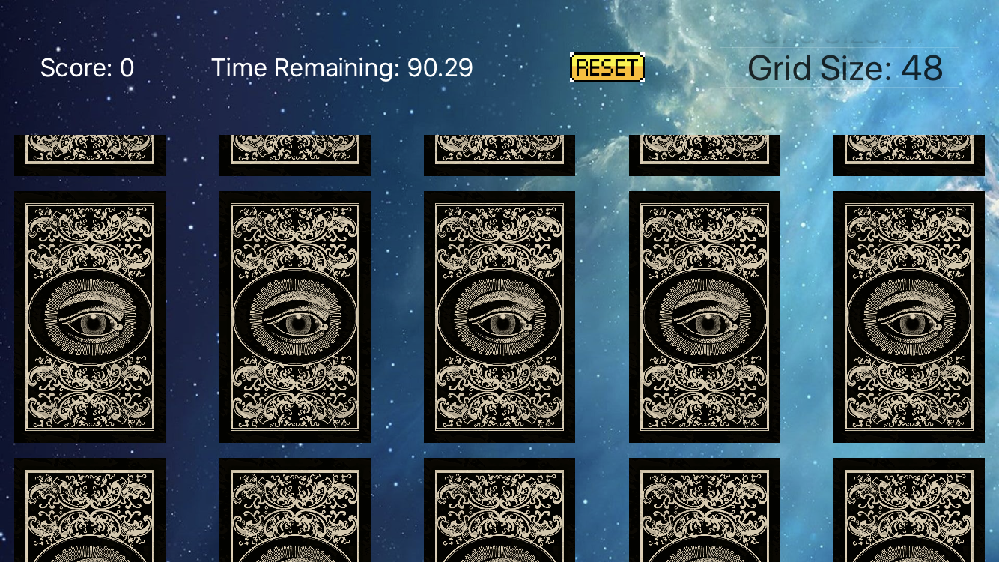
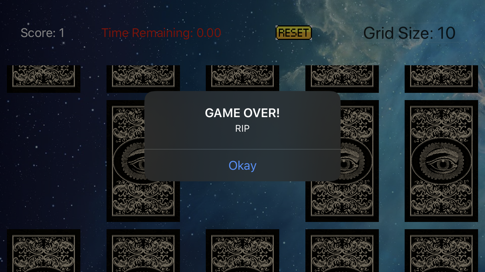

# matchGame-iOS
A mobile card match game

Built for fun.

Some features:
- Sounds
- Restart game button/reshuffle
- Timer
- Score
- Configurable Grid Size

Used official documentation, stack overflow, youtube, google, many iOS development tutorials/courses while building the game, forums

